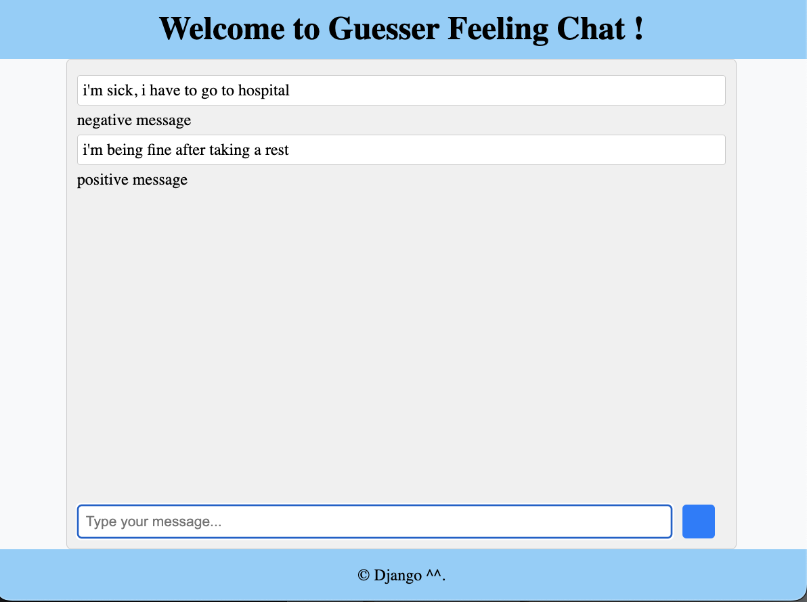

# Project Execution Instructions

To successfully run this project, please ensure that you have the following Python libraries installed:
- Channels==4.1.0
- Django==5.0.6
- nltk==3.8.1
- pandas==1.5.3
- scikit_learn==1.2.1

### Running the Servers

1. **Django Server:**
   ```bash
   python manage.py runserver
   ```

2. **WebSocket Server:**
   ```bash
   daphne -p 1999 chatDjango.asgi:application
   ```

# Feeling Unsure? Let Me Guess!

Are you struggling with your feelings? Unsure of how you truly feel? 
Let me help! Share your thoughts, and I'll take a guess at your emotions with a 70% chance of being right! 😄
This is done using NLP with Gaussian methods, with the help of ChatGPT throughout the process.


# Source data:
- IMDb: Maas et al., 2011, 'Learning word vectors for sentiment analysis'

## Screenshot

Here is a screenshot of the application
